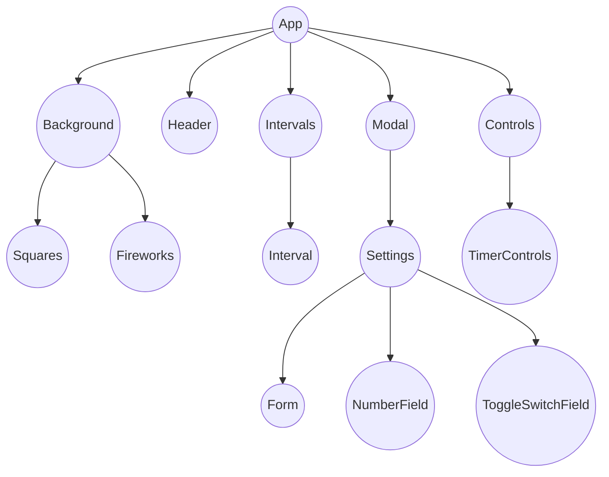

# Pomodoro timer

[](public/pomodoro-timer.jpg)

A pomodoro timer with an auto next feature.

## Project Structure (src)

```

├── components
│   ├── Background 		<- Renders the 'wordle' title
│   ├── Controls			<- Renders a single letter input.
│   ├── Form 			    <- Renders every cell and shows game states (loose, win, errors) for a single row
│   ├── Header			  <- Renders every row
│   ├── Intervals 		<- Renders the qwerty keyboard
│   ├── Modal         <- Renders a tooltip to show game states (loose, win, errors) textually
│   ├── TimerControls <- Renders a tooltip to show game states (loose, win, errors) textually
│   ├── Interval      <- Renders a tooltip to show game states (loose, win, errors) textually
│   └── Settings 			<- Renders the Grid and Keyboard
├── types 			      <- TypeScript types.
├── hooks
│   ├── useLocalStorage.ts 		<- Logic for tracking guesses
│   ├── useTimer.ts 		<- Logic for tracking guesses
│   ├── useTitle.ts 		<- Logic for tracking guesses
│   └── useWorkInterval.ts 		<- Capture all key presses, returns key values
└── constants
```

## Component Tree


