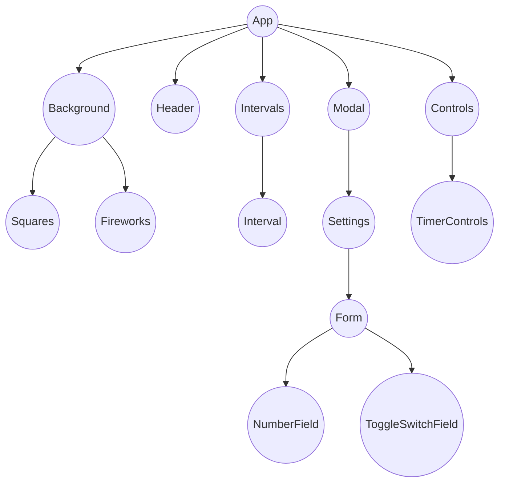

# Pomodoro timer

[](public/pomodoro-timer.jpg)

A pomodoro timer with an auto next feature.

[Demo](https://ingadi.github.io/pomodoro-timer/).


## Data model

The application contains the following models:

- User - can:
  - start/end intervals, solo or as part of a peer group
  - customize interval durations
  - join a peer group to share interval sessions
  - edit work session goals


- Intervals: represents the durations of 3 timers:
  - Work: (Also called pomodoro). Focus time, default 25 minutes
  - Short break: Comes after focus time, default 5 minutes
  - Long break: Default 15 minutes, comes after a set number of work intervals, default 4

- Analytics: represents the total number of Interval sessions a user has completed.


## Project Structure

```

├── components
│   ├── Squares     <- Handles the square background
│   ├── Fireworks     <- Handles the fireworks background
│   ├── Background      <- Picks between the backgrounds (squares, fireworks)
│   ├── Controls      <- Renders the timer and settings controls.
│   ├── TimerControls     <- Controls the timer
│   ├── NumberField     <- Handles number field
│   ├── ToggleSwitchField     <- Handles toggle switch field
│   ├── Header      <- Renders interval name and the day's goals
│   ├── Interval      <- Handles rendering of the timer duration
│   ├── Intervals     <- Renders both the current interval and details of the interval coming up next
│   ├── Modal     <- Renders the settings
│   ├── Settings      <- Renders the form
│   └── Form      <- Defines and renders the input fields to update default configuration
├── types     <- TypeScript types.
├── hooks
│   ├── useLocalStorage.ts      <- Retrieving and storing values in local storage
│   ├── useTimer.ts     <- Updating timer every second
│   ├── useTitle.ts     <- Updating document title
│   └── useWorkInterval.ts      <- Saves/resets work interval count for the day
└── constants     <- Project constants.
```

## Component Tree


